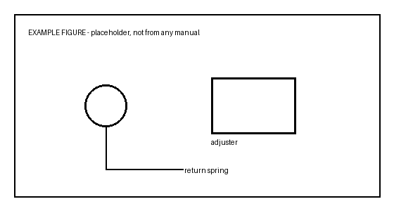

# Example Job Sheet — Rear Parking Brake Shoes

> This is a **format demonstration**, not a real procedure. Every figure and
> specification below is invented. Do not follow it on a vehicle. Build your
> own from your own manual pages.

Source: your own service manual subscription.
**Not touched in this job:** the hydraulic system. No line is opened, no fluid
is drained, no bleeding is required.

---

## 0. Before leaving the house

- [ ] Sockets confirmed by trial fit on the actual bolts
- [ ] Torque wrench covering both 6 N·m and 100 N·m (usually two wrenches)
- [ ] Jack, two axle stands, four wheel chocks
- [ ] Wire to hang the caliper — never let it hang on the flexible hose
- [ ] One-time parts on hand (see torque table)
- [ ] Phone charged, this file saved offline
- [ ] Camera ready — photograph every spring before removing it

---

## 1. Securing the vehicle

1. Park nose uphill on the flattest ground available
2. Chock both wheels of the axle staying down, front and back of each
3. Loosen the wheel nuts while the wheel is still on the ground
4. Power off, confirm the ready lamp is out
5. Release the parking brake and select N — the disc must turn freely later
6. Jack at the designated point, support at the designated points

!> Never place any part of your body under a vehicle held only by a jack, however briefly.

---

## 2. Vehicle-specific cautions

!> Do not start the vehicle while the caliper is off — system pressure can rise.

> Do not press the brake pedal while the caliper is removed.

---

## 3. Disassembly

1. Remove the wheel
2. Unbolt the caliper, hang it on wire, remove the anti-rattle plates
3. Matchmark the disc to the hub, then remove the disc
4. Remove the return springs, the adjuster, then the shoes

> If the disc will not come off, back the shoe adjuster off through the access hole.

---

## 4. Inspection

| Item | Standard | Limit |
| --- | --- | --- |
| Drum inside diameter | 190 mm | 191 mm max |
| Shoe lining thickness | 2.5 mm | 1.0 mm min |

- [ ] Return springs intact and still tensioned
- [ ] Adjuster turns freely, not seized
- [ ] No drag marks on the drum surface

---

## 5. Reassembly

1. Grease the marked contact points with high-temperature grease
2. Fit the shoes, adjuster, then both return springs
3. Refit the disc, aligning the matchmarks
4. **Adjust the shoe clearance now** — expand until the disc locks, then back off the specified number of notches
5. Refit the caliper with new plates, torque per table
6. Refit the wheel

> Adjusting after the caliper is refitted means taking it apart again.

---

## 6. Torque values

| Fastener | N·m | Note |
| --- | --- | --- |
| Caliper bolt A | 54 | 40 ft-lb |
| Caliper bolt B | 65 | 48 ft-lb |
| Wheel nut | 103 | 76 ft-lb |
| Cable lock nut | 6.0 | **53 in-lbf — not ft-lb** |
| ~~Anchor block~~ | ~~76~~ | not removed in this job |

**One-time parts:** anti-rattle plates ×2

---

## 7. If you get stuck

| Situation | What to do |
| --- | --- |
| Disc will not release | Back off the adjuster; then use the jacking holes |
| Adjuster seized | Penetrating oil, then replace — do not force |
| Spring will not seat | Hook the difficult end first, use spring pliers |
