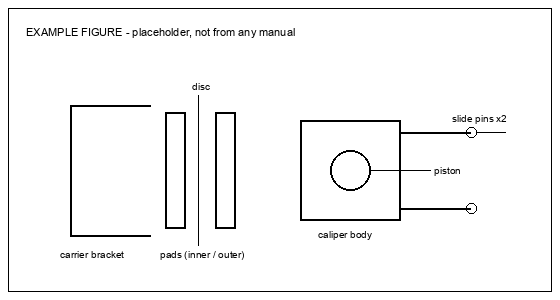

# Example Job Sheet — Rear Brake Pads

> This is a **format demonstration**, not a real procedure. Every figure, torque value and wear limit below is invented. Do not follow it on a vehicle — build your own sheet from your own manual pages, for your own car.

Source: your own service manual subscription.

**Not touched in this job:** the hydraulic system. No line is opened, no fluid is drained, no bleeding is required. Discs stay on the car.

---

## 0. Before leaving the house

- [ ] New pads confirmed against the caliper — measure, don't trust the box
- [ ] Scan tool that can put the parking brake into maintenance mode, tested and paired **before** jacking the car
- [ ] Sockets confirmed by trial fit on the actual bolts
- [ ] Torque wrench covering both 12 N·m and 110 N·m — usually two wrenches
- [ ] Piston tool: check whether this caliper presses or **screws** in (§2)
- [ ] Jack, two axle stands, four wheel chocks
- [ ] Wire to hang the caliper — never let it hang on the flexible hose
- [ ] Brake cleaner, high-temperature grease, a turkey baster for fluid
- [ ] One-time parts on hand (see torque table)
- [ ] Phone charged, this file saved offline

> Retracting two rear pistons pushes fluid back up the system. If the reservoir is at MAX now, draw some out before you start — not while it is running down the wing.

---

## 1. Securing the vehicle

1. Park on the flattest ground available, nose uphill
2. Chock both wheels of the axle staying down, front and back of each
3. Loosen the wheel nuts while the wheel is still on the ground
4. Power off, confirm the ready lamp is out
5. Jack at the designated point, support at the designated points
6. Do both sides — pads are replaced in axle sets, never one corner

!> Never place any part of your body under a vehicle held only by a jack, however briefly.

---

## 2. Vehicle-specific cautions

!> If the rear calipers carry an electric parking brake, the actuator must be put into maintenance mode with a scan tool before the piston is retracted. Forcing a motor-driven piston back mechanically strips the actuator gearing — this is the one step that turns a two-hour job into a new caliper.

!> Do not press the brake pedal while the pads are out. The piston will come past its seal, and you will be opening the hydraulic system after all.

> Rear pistons on parking-brake calipers frequently **screw** in clockwise rather than pressing straight in. Establish which type this is before reaching for a G-clamp — pressing a screw-in piston destroys the mechanism.

> Take the parking brake out of maintenance mode before road testing, and confirm the dash warning has cleared.

---

## 3. Disassembly

1. Remove the wheel
2. Put the parking brake actuator into maintenance mode and wait for the motor to finish retracting
3. Photograph the wear sensor routing and every clip before removing anything
4. Unbolt the lower slide pin bolt, pivot the caliper body up, support it on wire
5. Lift out the old pads and the anti-rattle shims, keeping inner and outer separate
6. Withdraw the slide pins, wipe them, inspect the boots

> Left and right are mirrored. Do one side completely, then use it as the reference photograph for the other.

---

## 4. Inspection

| Item | Standard | Limit |
| --- | --- | --- |
| Pad lining thickness | 11.0 mm | 1.0 mm min |
| Disc thickness | 12.0 mm | 10.5 mm min |
| Disc runout | — | 0.05 mm max |

- [ ] Pads worn evenly across the face, and inner against outer
- [ ] Slide pins move freely by hand, boots not split or perished
- [ ] Piston boot intact, no fluid weeping behind it
- [ ] Disc face free of scoring, outer edge lip within limit
- [ ] Wear sensor intact, or the replacement on hand

> Uneven inner-to-outer wear is a seized slide pin, not a pad fault. New pads on a seized pin wear out exactly the same way.

---

## 5. Reassembly

1. Clean the carrier abutments back to bare metal — do not file them
2. Grease the abutment contact points and the slide pins with high-temperature grease, and keep copper grease off the pin rubber
3. Fit new shims, then the pads, with the wear sensor on the specified side
4. Retract the piston by the method established in §2 — screw or press
5. Check the reservoir level as you go, not after both sides are done
6. Pivot the caliper down, torque the slide pin bolt per table
7. Refit the wheel, torque per table in a star pattern
8. **Take the actuator out of maintenance mode before lowering the car**
9. Pump the brake pedal until firm *before the vehicle moves*

!> A vehicle moved before the pedal is pumped firm has no brakes on the first application.

---

## 6. Final checks and road test

- [ ] Pedal firm and high, not sinking under steady pressure
- [ ] Reservoir between MIN and MAX, cap seated
- [ ] Parking brake warning cleared on the dash
- [ ] Parking brake holds on a slope, in both directions
- [ ] Wheel nuts re-torqued with the car on the ground
- [ ] Low-speed stops in an empty area before any road use
- [ ] Bed-in per the pad manufacturer's instructions

> Re-check the wheel nut torque again after the first short drive.

---

## 7. Torque values

| Fastener | N·m | Note |
| --- | --- | --- |
| Slide pin bolt | 34 | 25 ft-lb |
| Carrier-to-knuckle bolt | 110 | 81 ft-lb |
| Wheel nut | 103 | 76 ft-lb, star pattern |
| Wear sensor screw | 1.4 | **12 in-lbf — not ft-lb** |
| ~~Brake hose union~~ | ~~15~~ | hose not disconnected in this job |

**One-time parts:** slide pin bolts ×2 per side, anti-rattle shims ×4 per side

---

## 8. If you get stuck

| Situation | What to do |
| --- | --- |
| Piston will not retract | Stop. Confirm maintenance mode is actually engaged, and confirm screw vs press, before applying any more force |
| Scan tool will not enter maintenance mode | Battery voltage is the usual cause — put it on a charger and retry before removing anything |
| Caliper will not pivot up | The upper slide pin is seized in its bore, not the bolt — free the pin rather than levering the body |
| Reservoir overflowed | Flush it off paintwork with water immediately; brake fluid lifts paint in minutes |
| Pedal goes to the floor afterwards | Do not drive it. Pump and re-check; if it stays soft, something has moved past a seal |
| Parking brake warning stays on | Still in maintenance mode, or the actuator did not complete its cycle — re-run the exit routine |

---

*Format demonstration for `service-manual-offline-kit`. A real job sheet is built from your own manual pages and carries your own vehicle's figures.*
